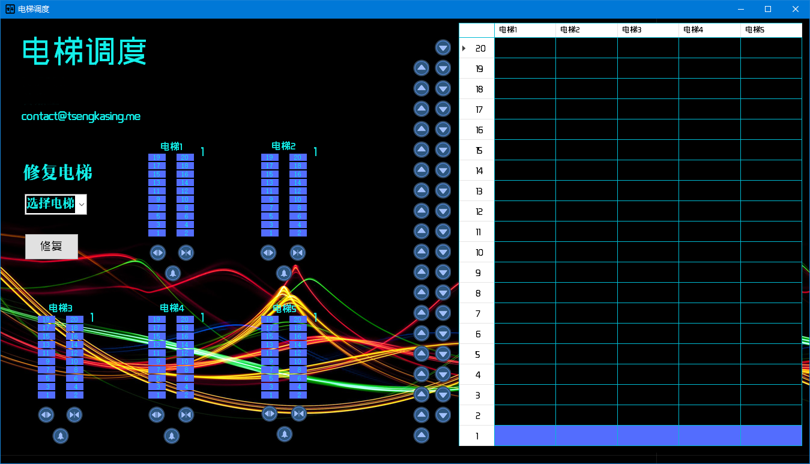
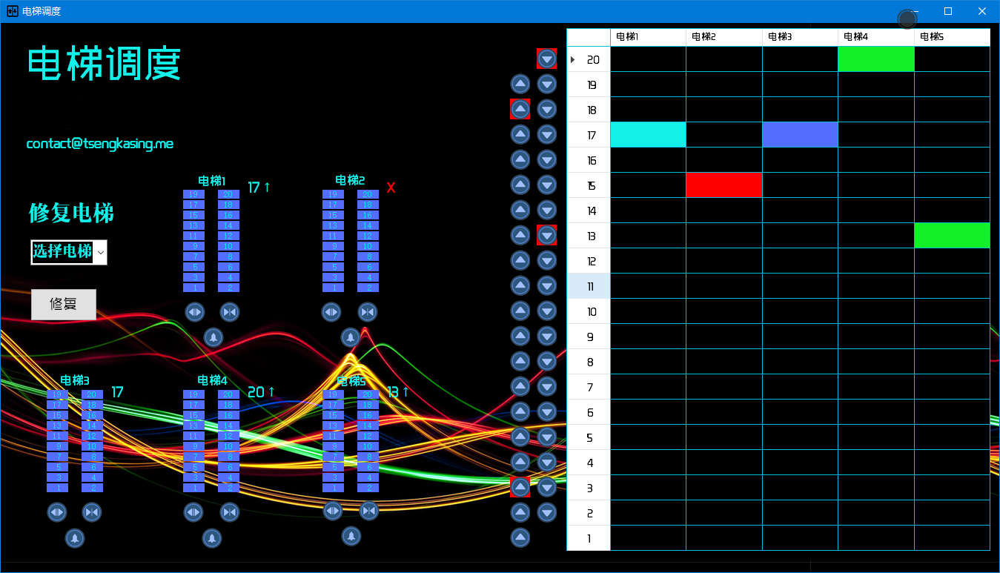

# Elevator_scheduler
An elevator scheduler written in C#

**打开方式**
	打开文件目录下 `/executive_program/elevator.exe `
双击执行即可

程序设计采用C#语言

**内部逻辑**

程序拥有一个枚举类型，分别表示电梯的不同状态： 空闲、上升、下降、损坏。
public enum direction{ Null = 0, up = 1, down = 2, broken = 3 };

程序使用线程库开启5个子线程来模拟5部电梯运行，在主线程处理按钮单击事件。
程序内部实现两个类，一个是电梯类，另一个是界面的类。

**电梯类**

    public class elevator 
    {
        public int tag;								//电梯标示
	    public bool active;							//电梯激活状态
	    public bool running;						//上升或下降途中
	    public bool openButton;						//开门键状态
	    public bool closeButton; 					//关门键状态
        public direction refuse;						//屏蔽方向
        public int refuse_floor;						//屏蔽楼层
	    public int now_floor;						//当前所在楼层
        public int now_obj_floor;					//当前目标楼层
	    public direction direct;						//当前运行方向

	    public SortedSet<int> upQueue;				//上升队列
        public SortedSet<int> downQueue;			//下降队列

	    public elevator(int Tag); 					//初始化电梯
        private void PushUpQueue(int obj_floor);       //添加到上升队列
        private void PushDownQueue(int obj_floor);    //添加到下降队列
	    public bool pressOpenButton();               //按开门按钮
        public bool pressCloseButton();               //按关门按钮
        public bool addQueue(int obj_floor);           //添加到队列
	};

电梯类只要是拥有两个队列来存储即将要去往的楼层，每次从相应方向的队列中取出一个目标楼层然后去往。
当运行方向为上时，每次从上升队列中取出最小的楼层，反之，运行方向向下时取出最大的楼层。
电梯每次到达楼层都会停8秒，在每一秒都会检测是否按下开门键或关门键。
检测到开门键按下时，会延长开门时间2秒，检测到关门键按下时，就直接关门，不在等待。
屏蔽是指不再接受某一楼层以下的所有楼层或某一楼层以上的所有楼层的呼叫。
每当电梯去接一个要下行的人时，就会屏蔽掉从这一楼层往上的所有楼层的呼叫，因为此时电梯要下行，直到把下降队列所有目标楼层都遍历完之后才会改变方向上升。
电梯调度采用距离最近且单向移动调度法，即每次呼叫时会选出不被屏蔽且距离最近的一部电梯。

**调度算法**
电梯调度的距离判断：
    当电梯已坏，不参与调度。
    当电梯所在楼层与呼叫楼层相同且电梯空闲时，则效果和按该电梯的开门键一样。
    当电梯当前所在楼层与呼叫楼层不同时
    当电梯空闲时，距离为电梯所在楼层和呼叫楼层的距离。
    当电梯当前运行方向和用户需要前往的方向相同时
    如果电梯已屏蔽该楼层，则电梯不参与此次调度。
    如果电梯当前向上运行
         如果呼叫楼层高于电梯目前所在楼层，则距离为电梯所在楼层和呼叫楼层的距离。
         如果呼叫楼层低于电梯目前所在楼层，则距离为当前楼层到上升队列中最高楼层的距离 加 上升队列中最高楼层到呼叫楼层的距离。
    如果电梯当前向下运行
         如果呼叫楼层低于电梯目前所在楼层，则距离为电梯所在楼层和呼叫楼层的距离。
         如果呼叫楼层高于电梯目前所在楼层，则距离为当前楼层到下降队列中最低楼层的距离 加 下降队列中最低楼层到呼叫楼层的距离。
    当电梯当前运行方向和用户需要前往的方向不同时，该电梯不参与此次调度。

算出所有电梯到呼叫楼层的距离后，取最小距离的电梯并将呼叫楼层加入到该电梯的相应运行队列中。

**界面类**

	public partial class Elevator_status : Form
	{
        bool Active;                                                //程序激活状态
        int select_to_fix = 0;                                      //选择修复的电梯

        const int MIN_WAIT_TIME = 100;                          //等待时间最小单位

        bool[] buttonUpOn;       			                    //上行键按钮
        bool[] buttonDownOn;			                         //下行键按钮

        List<Thread> threadlift = new List<Thread>();               //存储线程的数组
        elevator[] ele = new elevator[5];                           //存储电梯实例的数组
        SortedDictionary<int, int> eleSelect = new SortedDictionary<int, int>(); //调度电梯距离排序

        /* 颜色资源加载 */
        Color lightGreen = Color.FromArgb(19, 224, 234);

        /* 图片资源加载 */
        Bitmap emptyIcon = new Bitmap("./Resources/elevator_null.png");
        Bitmap freeIcon = new Bitmap("./Resources/elevator_free.png");
        Bitmap movingIcon = new Bitmap("./Resources/elevator_run.png");
        Bitmap openIcon = new Bitmap("./Resources/elevator_open.png");
        Bitmap brokenIcon = new Bitmap("./Resources/elevator_broken.png");

        public Elevator_status();                                        //界面初始化
        public void InitialButton();                                     //按钮初始化
        public void InitialFontAndImage();
        public void run(ref elevator e);                                 //电梯调度
        public bool people_wait(int wait_floor, direction wait_direct);        //外部等待

        delegate void SetNumericCallBack(int ele, int floor, direction direct);

        public void SetNumeric(int ele, int floor, direction direct);          //设置数码显示楼层
        gpublic void SetIcon(int ele, int target, int icon);              			   //设置方块
        public void move(int ele, int from, int to);                     		   //电梯移动

        private void Begin();                                              //开始
        private void buttonUp_Click(object sender, EventArgs e) ;                //上行键
        private void buttonDown_Click(object sender, EventArgs e) ;             //下行键
        private void buttonOpen_Click(object sender, EventArgs e);              //开门键
        private void buttonClose_Click(object sender, EventArgs e);              //关门键
        private void buttonWarning_Click(object sender, EventArgs e);            //报警键
        private void elevator_1_Floor_Click(object sender, EventArgs e);          //电梯1数字键
        private void elevator_2_Floor_Click(object sender, EventArgs e);          //电梯2数字键
        private void elevator_3_Floor_Click(object sender, EventArgs e);          //电梯3数字键
        private void elevator_4_Floor_Click(object sender, EventArgs e);          //电梯4数字键
        private void elevator_5_Floor_Click(object sender, EventArgs e);          //电梯5数字键
        private void select_elevator_fix_SelectedIndexChanged(object sender, EventArgs e);   //选择修复的电梯
        private void button_Fix_Click(object sender, EventArgs e);                   //修复电梯
        private void Elevator_status_Closing(object sender, FormClosingEventArgs e);   //关闭线程
	}

**界面**

界面有10个Label展示信息
    包括程序名称，学号，姓名，邮箱，电梯标识等。
一个表格
用于直观地显示电梯所在楼层
    蓝色表示电梯空闲
    浅绿色表示电梯正在上升或下降
    绿色表示电梯处于开门状态
    红色表示电梯已损坏，等在修复
    黑色表示电梯不在该楼层
按钮
19个上行键
19个下行键
每个电梯有一个操作面板
每一个面板有20个楼层键
一个开门键
一个关门键
一个报警键
一个数码显示器
界面左边还有一个修复电梯的按钮
在电梯按下报警键后，电梯会停止工作，需要修复才能重新工作。

	如上图所示
        电梯1正在上升
        电梯2已损坏，等待修复
        电梯3处于空闲状态
        电梯4处于开门状态
        电梯5处于开门状态
